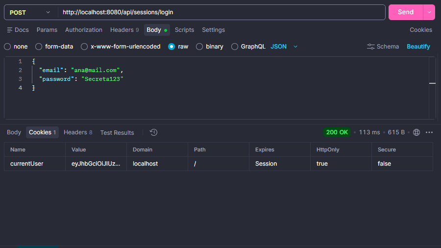
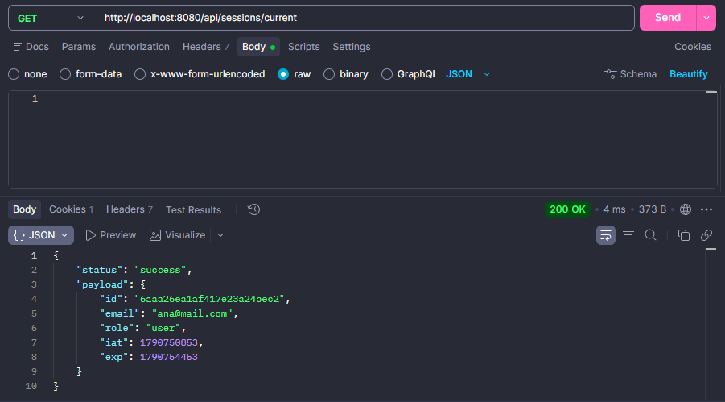
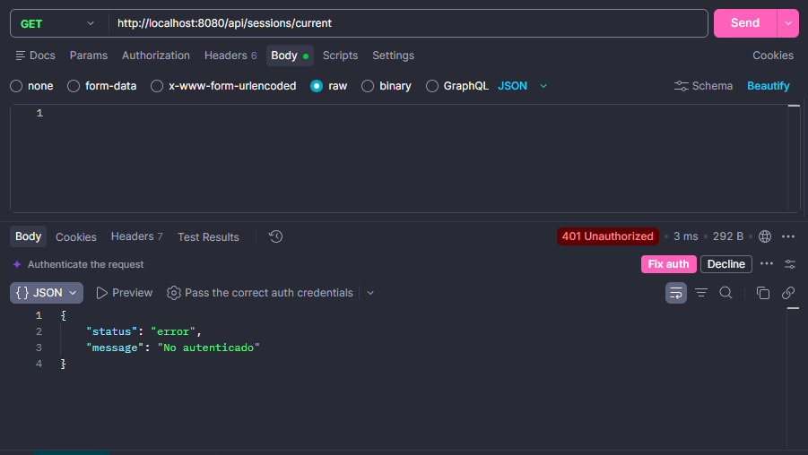

# Plataforma de Eventos e Inscripciones

API REST para la gestión de eventos e inscripciones/tickets, desarrollada como proyecto final del curso Backend II de Coderhouse. Permite administrar usuarios, eventos, categorías e inscripciones, con roles diferenciados (admin, organizador y usuario).

Este repositorio corresponde a la Pre-entrega 3: autenticación con JWT y cookies, construida sobre la base de las entregas anteriores (arquitectura en capas y registro seguro de usuarios). Implementa el flujo completo de sesión: login con generación de JWT, cookie de autenticación HTTP Only, ruta protegida para consultar el usuario autenticado, y logout.

## Tecnologías

- Node.js
- Express
- MongoDB Atlas
- Mongoose
- dotenv
- bcrypt
- jsonwebtoken
- cookie-parser
- Nodemon (entorno de desarrollo)

## Instalación

```bash
git clone <url-del-repositorio>
cd PlataformaDeEventos
npm install
```

## Configuración de variables de entorno

Copiar el archivo `.env.example` como `.env` y completar los valores:

```bash
cp .env.example .env
```

Variables necesarias:

| Variable | Descripción |
|---|---|
| `PORT` | Puerto en el que corre el servidor |
| `NODE_ENV` | Entorno de ejecución (`development` / `production`) |
| `MONGO_URL` | Cadena de conexión a MongoDB Atlas |
| `JWT_SECRET` | Clave secreta para firmar y verificar los tokens JWT |
| `JWT_EXPIRES_IN` | Tiempo de expiración del token (ej. `1h`) |

## Cómo ejecutar

Modo desarrollo (con reinicio automático):

```bash
npm run dev
```

Modo producción:

```bash
npm start
```

El servidor levanta por defecto en el puerto indicado en `PORT`, o en `8080` si no está definido.

## Estructura de carpetas

```
PlataformaDeEventos/
├── src/
│   ├── app.js                # Configura Express (middlewares y rutas)
│   ├── server.js             # Levanta el servidor y conecta la base de datos
│   ├── config/                # Configuración (conexión a MongoDB)
│   ├── routes/                # Definición de endpoints
│   ├── controllers/           # Reciben la petición y arman la respuesta HTTP
│   ├── services/              # Lógica de negocio (validaciones, reglas, orquestación)
│   ├── repositories/          # Abstracción de acceso a datos, independiente de Mongoose
│   ├── dao/                   # Acceso directo a la base de datos (Mongoose)
│   ├── models/                 # Schemas de Mongoose (User, Event, ...)
│   ├── middlewares/            # Middlewares (auth.middleware.js: protección de rutas con JWT)
│   └── utils/                   # Funciones reutilizables (hash.js: bcrypt, jwt.js: firma/verificación de JWT)
├── .env.example
├── .gitignore
├── package.json
└── README.md
```

El flujo de sesión (registro, login, current, logout) sigue la arquitectura completa: `sessions.router.js` → `sessions.controller.js` → `sessions.service.js` → `users.repository.js` → `users.dao.js` → modelo `User`, con `utils/jwt.js` y `utils/hash.js` como utilidades compartidas y `middlewares/auth.middleware.js` protegiendo la ruta `/current`. El resto de los recursos (eventos, tickets) todavía son placeholders a desarrollar en próximas entregas.

## Rutas disponibles

| Método | Ruta | Descripción | Protegida |
|---|---|---|---|
| GET | `/api/health` | Verifica que el servidor esté activo | No |
| POST | `/api/sessions/register` | Registra un nuevo usuario | No |
| POST | `/api/sessions/login` | Inicia sesión y setea la cookie de autenticación | No |
| GET | `/api/sessions/current` | Devuelve los datos del usuario autenticado | Sí |
| POST | `/api/sessions/logout` | Cierra la sesión (elimina la cookie) | Sí |
| GET | `/api/events` | Lista de eventos (por ahora devuelve un arreglo vacío) | No |
| POST | `/api/events` | Crea un evento (placeholder, sin lógica de base de datos aún) | No |
| GET | `/api/users` | Placeholder de usuarios | No |
| POST | `/api/users` | Placeholder de usuarios | No |
| GET | `/api/tickets` | Placeholder de tickets | No |
| POST | `/api/tickets` | Placeholder de tickets | No |

## Registro de usuarios — `POST /api/sessions/register`

Crea un usuario nuevo. Valida los datos recibidos, normaliza el email, evita duplicados y guarda la contraseña hasheada con bcrypt — nunca en texto plano.

**Campos esperados (body JSON):**

| Campo | Tipo | Obligatorio | Validación |
|---|---|---|---|
| `first_name` | string | Sí | No vacío |
| `last_name` | string | Sí | No vacío |
| `email` | string | Sí | Formato de email válido |
| `password` | string | Sí | Mínimo 8 caracteres |

El `role` no se recibe del cliente: siempre se asigna `user` en el servidor, sin importar qué envíe el body.

**Request de ejemplo:**

```json
{
  "first_name": "Ana",
  "last_name": "Pérez",
  "email": "Ana@Mail.com",
  "password": "Secreta123"
}
```

**Respuesta exitosa (`201`)** — el email queda normalizado (minúsculas, sin espacios) y la contraseña nunca se devuelve:

```json
{
  "status": "success",
  "message": "Usuario registrado",
  "payload": {
    "id": "665f2a...",
    "first_name": "Ana",
    "last_name": "Pérez",
    "email": "ana@mail.com",
    "role": "user"
  }
}
```

**Respuestas de error:**

| Código | Causa | Mensaje |
|---|---|---|
| `400` | Falta algún campo obligatorio | `Todos los campos son obligatorios` |
| `400` | Email con formato inválido | `El email no es válido` |
| `400` | Contraseña de menos de 8 caracteres | `La contraseña debe tener al menos 8 caracteres` |
| `409` | Ya existe un usuario con ese email | `Ya existe un usuario registrado con ese email` |

## Login — `POST /api/sessions/login`

Valida credenciales y, si son correctas, genera un JWT y lo guarda en una cookie HTTP Only llamada `currentUser`. El token nunca se devuelve en el body de la respuesta.

**Campos esperados (body JSON):**

| Campo | Tipo | Obligatorio |
|---|---|---|
| `email` | string | Sí |
| `password` | string | Sí |

**Request de ejemplo:**

```json
{
  "email": "ana@mail.com",
  "password": "Secreta123"
}
```

**Respuesta exitosa (`200`)** — además del body, la respuesta incluye la cookie `currentUser`:

```json
{
  "status": "success",
  "message": "Login correcto"
}
```

Configuración de la cookie: `httpOnly: true` (no accesible desde JavaScript del navegador), `sameSite: 'lax'`, `maxAge: 3600000` (1 hora), `secure: true` solo cuando `NODE_ENV=production`.

El JWT se firma con `JWT_SECRET` y expira según `JWT_EXPIRES_IN`. Su payload contiene únicamente `{ id, email, role }` — nunca la contraseña.

**Respuesta de error (`401`)** — mismo mensaje genérico tanto si el email no existe como si la contraseña es incorrecta, para no revelar cuál de los dos datos falló:

```json
{
  "status": "error",
  "message": "Credenciales inválidas"
}
```

## Usuario actual — `GET /api/sessions/current`

Ruta protegida. Devuelve los datos del usuario autenticado a partir de la cookie `currentUser`, sin necesidad de volver a enviar email y contraseña.

Pasa por `authMiddleware`, que lee la cookie, verifica el JWT (firma y expiración) y guarda el resultado en `req.user`.

**Respuesta exitosa (`200`)** — con la cookie válida:

```json
{
  "status": "success",
  "payload": {
    "id": "665f2a...",
    "email": "ana@mail.com",
    "role": "user"
  }
}
```

**Respuesta de error (`401`)** — sin cookie, o con un token inválido, manipulado o expirado:

```json
{
  "status": "error",
  "message": "No autenticado"
}
```

## Logout — `POST /api/sessions/logout`

Elimina la cookie `currentUser`, cerrando la sesión.

**Respuesta (`200`):**

```json
{
  "status": "success",
  "message": "Sesión cerrada"
}
```

Después del logout, una nueva petición a `GET /api/sessions/current` responde `401`.

## Cómo probarlo

Con el servidor corriendo (`npm run dev`), usar Postman o Insomnia (con las cookies habilitadas, ya que el login depende de ellas) para probar, en orden:

1. `POST /api/sessions/register` — registro exitoso.
2. `POST /api/sessions/login` — con esas credenciales; confirmar que la cookie `currentUser` aparece en la respuesta.
3. `GET /api/sessions/current` — con la cookie, debe devolver `200` y los datos del usuario.
4. `POST /api/sessions/logout` — debe devolver `200`.
5. `GET /api/sessions/current` — repetido después del logout, debe devolver `401`.
6. `POST /api/sessions/login` con un email inexistente — debe devolver `401` con el mensaje genérico.
7. `POST /api/sessions/login` con la contraseña incorrecta — debe devolver `401` con el mismo mensaje genérico.
8. `GET /api/sessions/current` sin cookie (por ejemplo en una pestaña donde no se haya hecho login) — debe devolver `401`.

Para confirmar que la contraseña se guarda de forma segura, revisar el usuario creado en MongoDB Atlas: el campo `password` debe verse como un hash de bcrypt (`$2b$10$...`), nunca como el texto original.

## Evidencia

**Login — cookie en la respuesta:**


**Current — 200 con cookie válida:**


**Current — 401 sin cookie:**


En esta etapa las demás rutas (eventos, tickets, usuarios) siguen siendo placeholders sin lógica de negocio ni conexión funcional con los modelos — eso se incorporará en las próximas entregas junto con roles y permisos, gestión de cupos, y notificaciones.
